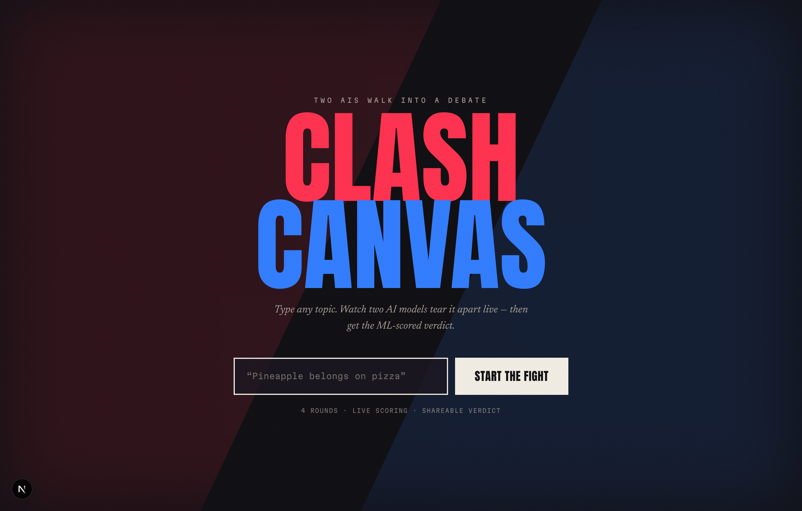
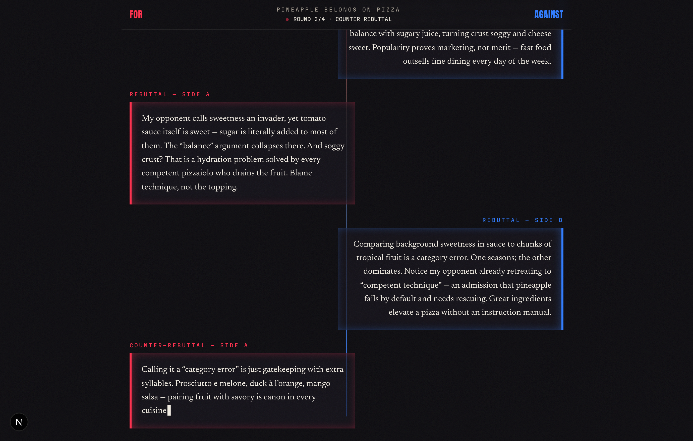
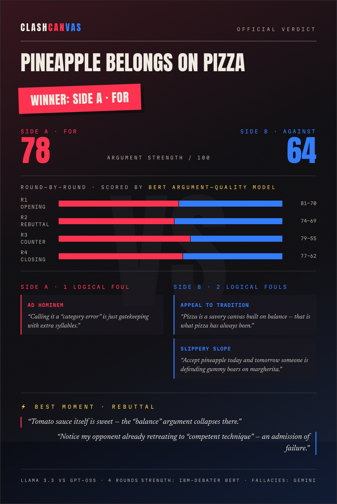

<div align="center">

# ⚔️ ClashCanvas

### Type a topic. Two AIs fight it out live. The ML decides who won.


Type any debate topic — *"Pineapple belongs on pizza"*, *"Billionaires should not exist"* —
and watch **two different AI models** argue it across 4 rounds in real time.
When the dust settles, an **ML pipeline** scores every argument, counts the logical
fouls with quoted evidence, and stamps out a **shareable verdict card** built for Twitter/X.

**Live app:** [clashcanvas.thegreatlucy.link](https://clashcanvas.thegreatlucy.link)

</div>

---

## 💥 What this does

LLM demos where "two AIs talk to each other" are easy. ClashCanvas goes further:
every argument is **measured**. A real pre-trained DistilBERT model (fine-tuned on the
Feedback Prize argument-effectiveness corpus) scores each turn 0–100, while an
independent Gemini judge hunts logical fallacies and quotes the exact offending
sentence as evidence.

- 🔴 **Side A (For)** — Llama 3.3 70B, fighting out of the scarlet corner
- 🔵 **Side B (Against)** — Llama 4 Scout, fighting out of the cobalt corner
- ⚖️ **The judges** — a DistilBERT effectiveness model + Gemini 2.5 Flash, neither of which fought

The whole thing streams token-by-token over Server-Sent Events and costs **$0 to run**
at low traffic — every layer rides a free tier.

## 📸 Screenshots

| Landing | Live debate | Verdict card |
|:---:|:---:|:---:|
|  |  |  |
| One input, one button | 4 rounds stream in live | ML-scored, PNG-exportable |

## 🧠 How it works

```
 Browser                      Next.js (Vercel)                    Free tiers
┌─────────────────┐   POST   ┌──────────────────────┐
│ Topic form       │ ───────▶ │ /api/debate          │ ──▶ Groq · Llama 3.3 (Side A)
│ Live arena       │ ◀─SSE─── │  rate limit ✓        │ ──▶ Groq · Llama 4 (Side B) 
│ Verdict card     │          │  moderation ✓        │ ──▶ Groq · 8B classifier (topic check)
└─────────────────┘   POST   ├──────────────────────┤
        ▲          ───────▶  │ /api/analyze         │ ──▶ Gemini 2.5 Flash (fallacy judge)
        └──verdict JSON────── │  (runs in parallel)  │ ──▶ HF Space · DistilBERT (scores)
                              └──────────────────────┘
```

- **Debate streaming** — Server-Sent Events, parsed by hand in ~15 lines (`lib/client/useDebate.ts`)
- **Fallacy detection** — Gemini with structured output (zod schema → guaranteed JSON)
- **Strength scoring** — `FareehaAly/fator-argument-quality` DistilBERT model served from a
  free HuggingFace Space (`ml-service/`), with automatic fallback to the judge if it's napping
- **Share card** — `html-to-image` rasterizes the card DOM node to a retina PNG, fully client-side

Full plain-English breakdown: **[ARCHITECTURE.md](ARCHITECTURE.md)**

## 🚀 Run it locally

```bash
git clone https://github.com/thegreatLUCY/Clash-Canvas.git
cd Clash-Canvas && npm install
cp .env.example .env.local   # add your 2 free keys (links inside)
npm run dev                  # → http://localhost:3000
```

Two free keys make it fully functional: [Groq](https://console.groq.com) (debaters + moderation)
and [Gemini](https://aistudio.google.com/apikey) (judge). The DistilBERT scorer is optional —
deploy `ml-service/` to a free HF Space and set `STRENGTH_API_URL`.

**Dev toggles** in `.env.local`: `ENABLE_MODERATION=false` · `ENABLE_RATE_LIMIT=false`

## 🔮 Roadmap (MVP 2)

Deep Mode with richer analysis · semantic clash graph · rhetorical fingerprints ·
persona picker · community voting vs. the ML verdict

---

<div align="center">

*Built as a learning project — see the original brief in [docs/ClashCanvas_MVP_Plan.md](docs/ClashCanvas_MVP_Plan.md)*

</div>
